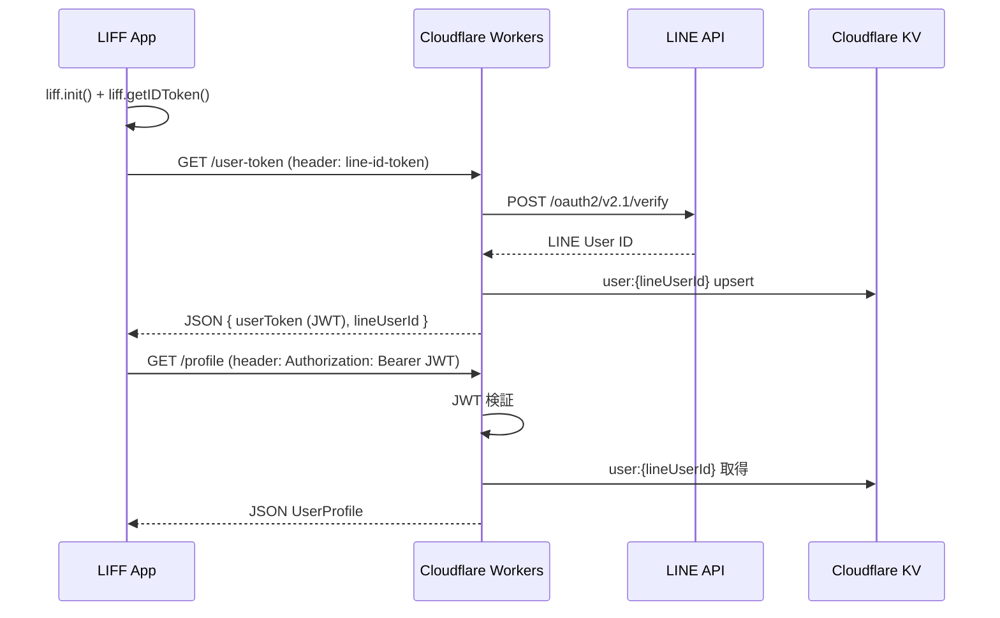

# LINE Auth API

LIFF + Cloudflare Workers + KV を使用した認証APIです。
LIFF SDK で取得した LINE ID Token をサーバー側で検証し、JWT を発行して API 認証を行います。

## 技術スタック

### インフラ / デプロイ
- **Cloudflare Workers** - サーバーレス実行環境
- **Cloudflare KV** - ユーザーデータの永続化
- **Wrangler** - Cloudflare Workers 公式 CLI

### Web フレームワーク
- **Hono** - 軽量・高速な Web フレームワーク（JWT ヘルパー含む）

### 言語 / 開発環境
- **TypeScript** - 静的型付け
- **Biome** - コードフォーマッタ兼リンター

### 外部 API
- **LINE Login v2.1** - ID Token 検証
- **LIFF SDK** - LINE ログイン・ID Token 取得

---

## データフロー



---

## ディレクトリ構成

```
src/
├── index.ts                  # Hono エントリポイント（CORS + ルーティング）
├── types.ts                  # 全型定義
├── routes/
│   ├── rootRoute.ts          # GET /
│   ├── userTokenRoute.ts     # GET /user-token
│   └── profileRoute.ts       # GET/PUT /profile
├── handler/
│   ├── rootHandler.ts        # HTML ステータスページ
│   ├── userTokenHandler.ts   # LINE ID Token → JWT 発行
│   └── profile/
│       ├── getProfileHandler.ts  # プロフィール取得
│       └── putProfileHandler.ts  # プロフィール登録・更新
├── middleware/
│   └── authMiddleware.ts     # Bearer JWT 認証
└── util/
    ├── lineApi.ts            # LINE API 通信
    ├── jwt.ts                # JWT 署名・検証
    └── userStore.ts          # ユーザーデータ CRUD
```

---

## エンドポイント

| メソッド | パス | 認証 | 説明 |
|---|---|---|---|
| GET | `/` | 不要 | HTML ステータスページ |
| GET | `/user-token` | `line-id-token` ヘッダー | JWT 発行 |
| GET | `/profile` | Bearer JWT | プロフィール取得 |
| PUT | `/profile` | Bearer JWT | プロフィール登録・更新 |

---

## セットアップ

### 1. 依存関係のインストール

```bash
npm install
```

### 2. LINE Developers Console の設定

1. [LINE Developers Console](https://developers.line.biz/console/) で LINE Login チャネルを作成
2. スコープに `profile` と `openid` を有効化

### 3. 環境変数の設定

ローカル開発用に `wrangler.dev.toml` を作成し、値を設定します（`.gitignore` 済み）。

```toml
[vars]
LINE_CHANNEL_ID = "あなたのチャネルID"
LINE_CHANNEL_SECRET = "あなたのチャネルシークレット"
FRONTEND_URL = "http://localhost:3000"
SESSION_SECRET = "任意の強い文字列"
```

本番環境のシークレットは CLI で登録します。

```bash
npx wrangler secret put LINE_CHANNEL_SECRET
npx wrangler secret put SESSION_SECRET
```

### 4. 開発コマンド

```bash
# 開発サーバーの起動
npm run dev

# フォーマット
npx biome format --write src/

# リント
npm run lint

# 本番デプロイ
npm run deploy
```

---

## ドキュメント

詳細は `document/` 配下を参照してください。

- [architecture.md](document/architecture.md) - アーキテクチャ・KV データ構造・FE 実装例
- [security.md](document/security.md) - セキュリティ対策・環境変数管理
- [command.md](document/command.md) - 開発コマンド一覧
