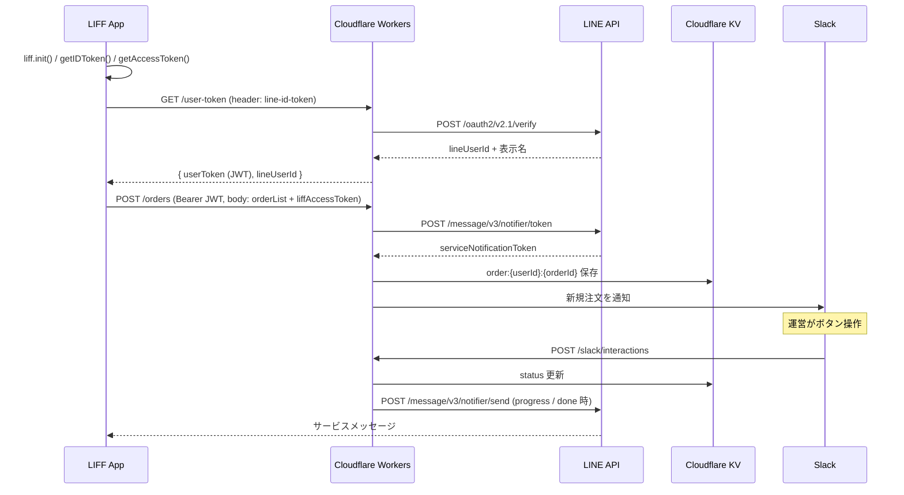

# LINE Order API

LIFF + Cloudflare Workers + KVを使用した注文受付APIです。
LINEミニアプリから注文を受け、Slackで運営に通知し、準備完了時にLINEサービスメッセージで注文者へ知らせます。
認証はLIFFのID Tokenをサーバーで検証し、JWTを発行して行います。

## 技術スタック

### インフラ / デプロイ

- **Cloudflare Workers** - サーバーレス実行環境
- **Cloudflare KV** - 注文データの永続化
- **Wrangler** - Cloudflare Workers公式CLI

### Web フレームワーク

- **Hono** - 軽量・高速なWebフレームワーク（JWTヘルパー含む）

### 言語 / 開発環境

- **TypeScript** - 静的型付け
- **Biome** - コードフォーマッタ兼リンター
- **textlint** - Markdownの文章リンター

### 外部サービス

- **LINE Login v2.1 / LIFF SDK** - ログイン・ID Token / アクセストークン取得
- **LINE MINI App サービスメッセージ** - 準備完了通知
- **microCMS** - メニューマスター（FEがビルド時に取得）
- **Slack** - 運営への新規注文通知・状態更新操作

---

## データフロー



---

## ディレクトリ構成

```
src/
├── index.ts                  # Hono エントリポイント（CORS + ルーティング）
├── types.ts                  # 全型定義
├── routes/
│   ├── rootRoute.ts          # GET /
│   ├── userTokenRoute.ts     # GET /user-token
│   ├── orderRoute.ts         # POST /orders, GET /orders/history
│   └── slackRoute.ts         # POST /slack/interactions
├── handler/
│   ├── rootHandler.ts        # HTML ステータスページ
│   ├── userTokenHandler.ts   # LINE ID Token → JWT 発行
│   ├── order/
│   │   ├── createOrderHandler.ts        # 注文作成
│   │   └── getOrderHistoryHandler.ts    # 注文履歴
│   └── slack/
│       └── interactionsHandler.ts       # Slack ボタン操作受け
├── middleware/
│   └── authMiddleware.ts     # Bearer JWT 認証
└── util/
    ├── lineApi.ts            # LINE API 通信
    ├── jwt.ts                # JWT 署名・検証
    ├── orderStore.ts         # 注文データ CRUD
    └── slackApi.ts           # Slack 通知・署名検証
```

---

## エンドポイント

| メソッド | パス                  | 認証                     | 説明                                          |
| -------- | --------------------- | ------------------------ | --------------------------------------------- |
| GET      | `/`                   | 不要                     | HTML ステータスページ                         |
| GET      | `/user-token`         | `line-id-token` ヘッダー | JWT 発行                                      |
| POST     | `/orders`             | Bearer JWT               | 注文作成（ボディに `liffAccessToken` を含む） |
| GET      | `/orders/history`     | Bearer JWT               | 注文履歴                                      |
| POST     | `/slack/interactions` | Slack 署名               | Slack ボタン操作の受け口                      |

メニュー一覧はmicroCMSをFEがビルド時に取得するため、本APIにエンドポイントを持ちません。

---

## セットアップ

### 1. 依存関係のインストール

```bash
pnpm install
```

### 2. 環境変数の設定

ローカルはテンプレートをコピーして値を埋めます（`wrangler.dev.toml` は `.gitignore` 済み）。`wrangler dev` は `wrangler secret put` を読まないため、シークレットもこのファイルの `[vars]` に置きます。

```bash
cp wrangler.dev.toml.example wrangler.dev.toml
```

本番は `wrangler secret put` で設定します。各変数の意味・一覧は仕様リポジトリ `line-order-document`（`_llm-docs/spec/backend/`）を参照してください。

### 3. 開発コマンド

```bash
pnpm dev      # 開発サーバー
pnpm format   # 整形（TS + md）
pnpm lint     # Lint（TS）
pnpm deploy   # 本番デプロイ
```

---

## ドキュメント

仕様の正本は別リポジトリ `line-order-document` で管理しています。`_llm-docs/spec/backend/` を参照してください。


### Git Subtreeによる\_documentディレクトリの管理

このプロジェクトでは、`_document/`ディレクトリを[line-order-document](https://github.com/webdev-jp-net/line-order-document)リポジトリからGit Subtreeで取り込んでいます。

#### 初回のみ: 取り込み

`_document/`がまだ無い場合（クローン直後など）は、`git subtree add` で初回取り込みを行います。2回目以降は `git doc-pull` で更新します。

```bash
git subtree add --prefix=_document git@github.com:webdev-jp-net/line-order-document.git develop --squash
```

#### 利用可能なGitエイリアス

| エイリアス | コマンド                                                                                                 | 説明                                                          |
| ---------- | -------------------------------------------------------------------------------------------------------- | ------------------------------------------------------------- |
| `doc-pull` | `git subtree pull --prefix=_document git@github.com:webdev-jp-net/line-order-document.git develop --squash` | documentリポジトリの最新内容を取り込む（developブランチから） |
| `doc-push` | `git subtree push --prefix=_document git@github.com:webdev-jp-net/line-order-document.git develop`          | \_document配下の変更をdocumentリポジトリにプッシュ            |

#### 開発フロー

1. **作業開始時は必ず最新の仕様を取り込む**

   ```bash
   # 作業開始前に必ず実行
   git doc-pull
   ```

2. **仕様書を編集した場合**
   ```bash
   # 変更をコミット後
   git doc-push
   ```

⚠️ **重要**: 作業開始時の`doc-pull`を忘れると、古い仕様に基づいた実装や、他の開発者との変更が衝突する可能性があります。

#### 使用方法

```bash
# documentリポジトリから最新の変更を取り込む
git doc-pull

# _document配下の変更をdocumentリポジトリにプッシュする
git doc-push
```

#### 注意事項

- `develop`ブランチで実行します
- 作業開始前に必ず`doc-pull`で最新の仕様書を取り寄せてください
- `_document/`配下のファイルを編集した場合は、プルリクエストのMergeが完了し解決したタイミングで`doc-push`してください